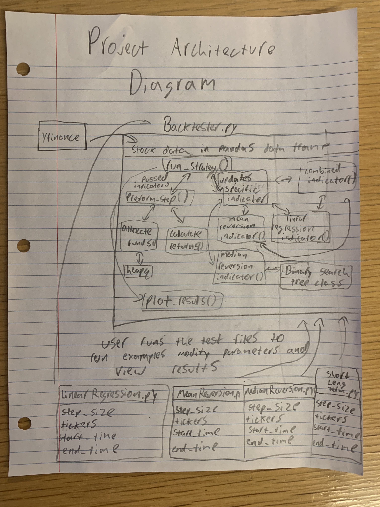

# COMS W3132 Individual Project

## Author
Jonah Singer jrs2338@columbia.edu

## Project Title
Stock Market Backtester with 4 Trading Strategies

## Project Description

I am interested in the intersection of computer science and finance so I would love to gain experience using Python to make financial models that can suggest stock trades. Trading stocks based on advanced statistical models and sophisticated data analysis in attempts to beat the stock market is a multi-billion dollar industry. This being the case, It is obvious that I will not be able to create algorithms that rival those of large companies. Nevertheless, I would like to implement a few algorithms and back-test them to see if I can generate any meaningful insights into the stock market and most importantly to gain experience working with financial data, using data structures, and testing algorithms. Before I was able to write algorithms I needed to get data from the stock market I did this with the yahoo finance yfinance package. I made a backtesting framework that executes each trading strategy over a specific total time period with a specified time step size. The backtester class stores the stock price data of specified tickers over a time frame in a pandas data frame. The backtester class can be run from the LinearRegression.py, MeanReversion.py, MedianReversion.py and ShortLongTerm.py files, where the parameters for each method can be changed. Over each time step of the total backtested period the backtester calls a specialized method for each trading strategy to generate a dictionary of indicators that it uses to buy and sell stocks. Based on the generated indicators from the previous time step the backtester buys and sells stocks proportional to the indicators magnitudes. The larger the magnitude of the indicator the more funds that are allocated to buying or selling the stock. Positive indicator indicates a recommended buy and negative indicates a recommended sell. Positions are held for one time step and the returns are calculated based on the actual price movement of the stocks. Having each trading strategy return indicators in this way allows the backtester to share the run_strategy(), perform_step(), allocate_funds(), calculate_returns(), and plot_results() methods across all trading strategies. These methods call each other appropriately to fully backtest, print the trades of, and plot the results of each strategy. The first strategy I created was the linear regression algorithm that takes linear regressions of the prices of many stocks over some period of time, X, and uses the linear regression to choose the stocks that are trending up to buy and trending down to sell. I tested this strategy using different step sizes. I also created a reverse linear regression strategy by simply flipping the sign of the generated indicators so that it chooses the stocks that are trending down to buy and trending up to sell. I also tested this strategy using different step sizes. The second algorithm I created was a mean reversion algorithm that calculated the moving average of stocks over some time interval, Y, and buys stocks when the price is below the moving average and shorts when the price is above the moving average. I tested this algorithm and the reverse of this algorithm. For the third algorithm I made a median reversion algorithm. It has the same idea as the mean reversion algorithm that stocks will tend to return back to the median but for this algorithm I wanted to get practice using a binary search tree for efficient finding of the median. This allowed the median reversion algorithm to run in average case nlong(n) time for each time step. For the fourth algorithm, I made an algorithm that was a combination of the two most profitable algorithms: the linear regression with step size 60 and the mean reversion with step size 5. To do this I made an algorithm that trades based off of these two indicators and it does so by calling the two already made algorithms and weighting the indicators equally. Throughout the project I used appropriate data structures and libraries to try and keep the running time of the algorithms as low as possible including numpy, pandas, heap, queue, and binary search tree (some algorithms still take some noticeable time due to the sheer volume of calculations needed for large time periods with short step sizes).

## Timeline

| Date               | Milestone                                                                                              | Deliverables                | Git tag    |
|--------------------|--------------------------------------------------------------------------------------------------------|-----------------------------|------------|
| **March&nbsp;29**  | Submit project description                                                                             | README.md                   | proposal   |
| **April&nbsp;5**   | Update project scope/direction based on instructor/TA feedback                                         | README.md                   | approved   |
| **April&nbsp;12**  | Basic project structure with empty functions/classes (incomplete implementation), architecture diagram | Source code, comments, docs | milestone1 |
| **April&nbsp;19**  | Progress on implementation (define your own goals)                                                     | Source code, unit tests     | milestone2 |
| **April&nbsp;26**  | Completely (or partially) finished implementation                                                      | Source code, documentation  | milestone3 |
| **May&nbsp;10**    | Final touches (conclusion, documentation, testing, etc.)                                               | Conclusion (README.md)      | conclusion |

## Requirements, Features and User Stories

The libraries needed to run the strategies are:
yfinance, pandas, LinearRegression from sklearn.linear_model, numpy, matplotlib.pyplot, and heapq.
These can be installed using pip install

This project has four different algorithms to trade in the stock market all integrated in a backtester. To test the algorithms run one of the example test files LinearRegression.py, MeanReversion.py, MedianReversion.py and ShortLongTerm.py a user can also modify the parameters of the algorithms in the tester. A user can use these algorithms to see what strategies have been historically profitable. The four algorithm types are: linear regression, mean reversion, median reversion, and a combined short term long term strategy that uses linear regression and mean reversion.
For each algorithm the user can adjust the step size (how often trades are made), the stocks considered, and the total time frame of the backtesting. The backtester prints all the trades that it makes and plots the returns for the requested strategy for easy evaluation of the strategies.

## Technical Specification
*Detail the main algorithms, libraries, and technologies you plan to use. Explain your choice of technology and how it supports your project goals.*

The main trading strategy algorithms are described in the project description section. Some data structures I used included heaps and binary search trees. A heap was used in the allocate funds strategy to store the indicators with their negative values for max-heap functionality so the algorithm can efficiently select what stocks to trade and calculate proportion of the total value of the portfolio to put towards each trade. A binary search tree was used in the median reversion strategy to efficiently find the median using the BST and inorder traversal. I also used a pandas dataframe to store the stock data from yfinance this was important for efficient retrieval for the calculate returns method and each individual strategies method of generating indicators based on the data from the last time step. Numpy and LinearRegression from sklearn.linear_model were used to perform the linear regression and generate the indicator based on the linear regression. All these choices were made to reduce the runtime of the algorithms because there is a large amount of total computations needed so it is important that the asymptotic runtime complexity is as low as possible. Additionally I choose to have each strategy generate indicators so that the main methods of the backtester run_strategy(), perform_step(), allocate_funds(), calculate_returns(), and plot_results() could be shared across all strategies as described in the project description section. This achieved one of my main goals of making the backtester scalable; it is very easy to add new strategies and test the reverse of strategies.

## System or Software Architecture Diagram

## Development Methodology
*Describe the methodology you'll use to organize and progress your work.*

The first step in my project will be obtaining and processing price data of stocks. I plan to get this data from the yahoo finance package in python.
Next I will make the backtesting framework DONE
Next I will make the linear regression algorithm DONE
Next I will test variations of the linear regression algorithm DONE
Next I will make the mean reversion algorithm DONE
Next I will test variations of the mean reversion algorithm DONE
Next I will make the machine learning algorithm
Next I will test variations of the machine learning algorithm
I will summerize the results and make graphs of different preformances of the algorithms

I will test all the algorithms functionality with the same backtesting framework that I will construct.

*First, describe your plan for developing your project. This might include how (or if) you plan to use*

- *GitHub projects board to track progress on tasks and milestones*
- *GitHub issues to keep track of issues or problems*
- *Separate Git branches and/or GitHub pull requests for development*
- *GitHub actions for automated testing or deployment pipelines*
- *GitHub wiki for documentation and notes*

*Please also describe how (if) you plan test and evaluate your project's functionality. Do you plan to test manually or automatically? Any specific testing frameworks or libraries you plan to use?*

## Potential Challenges and Roadblocks
*Identify any potential challenges or roadblocks you anticipate facing during the development of your project. For each challenge, propose strategies or solutions you might use to overcome them, which may include getting help from the TAs/instructor. This could include technical hurdles or learning new technologies.*

I think the hardest parts will be making an interface where I can back test algorithms and making the machine learning algorithm.
Missing stock data.
I do not know anything about machine learning yet so I will need to watch tutorials and read up on how to make a nueral network.

## Additional Resources
*Include any additional resources, tutorials, or documentation that will be helpful for this project.*

## Conclusion and Future Work
*Wrap up your project description with any final thoughts, expectations, or goals not covered in the sections above. Also briefly discuss potential future work, i.e., what could be done next to improve the project.*
